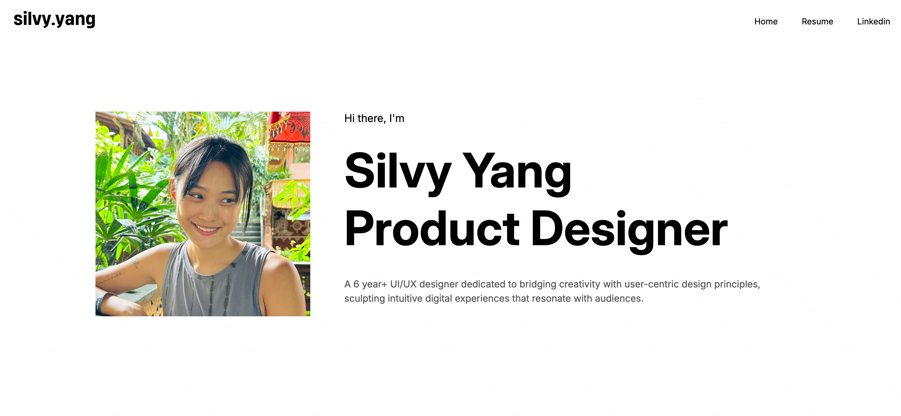

# Static Web Designer Portfolio 
This project was created to study React and to build my friend's portfolio.
I used only basic CSS for the overall structure without any additional stacks.
Wishing my friend great success! 🚀

#### Main Page

URL: https://designer-portfolio-nine.vercel.app/

# Tech Stack

